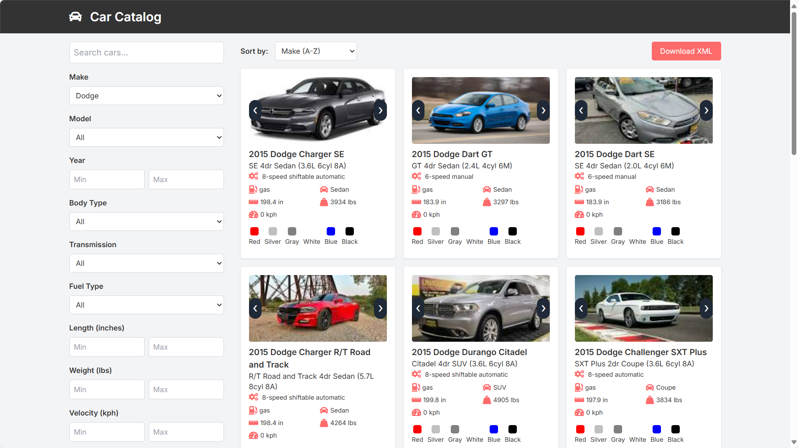

# 🚗 cars-website

Try it here https://cars-website.sololeveling.quest
> **WARNING**: *If somehow the SSL is not detected, please proceed; it is still safe to continue.*

This project uses Quarkus, the Supersonic Subatomic Java Framework.

If you want to learn more about Quarkus, please visit its website: <https://quarkus.io/>.

## 📄 Data Source
- The car data taken from https://carapi.app/features/vehicle-csv-download, without velocity and color.
- For several records, the velocity and color are populated using OpenAI GPT-4o-mini.
- For several records, the velocity value has been randomized with the following SQL:
```sql
UPDATE cars 
SET velocity = FLOOR(180 + RANDOM() * (280 - 180 + 1)) 
WHERE velocity = 0; 
```
- For several records, the color and image url are fetched from Google Image Search
    - There will be some delay when rendering the car card if the image URL is not available in the database.
    - When the image URL is not available, it will be fetched from Google Image Search and then saved to the database.

## 💻 Server Location 
- The website has been deployed in the Singapore region.
- The PostgreSQL database is also deployed in the AWS Singapore region via the Neon.tech platform. 
> **DISCLAIMER**: *A difference in response time between the demo video and reality is expected when accessed from regions far from Singapore.*

## 🎞️ Demo Video (~3 minutes)

> **WATCH NOW**: https://www.loom.com/share/b7bc9c771463490e9ba75e248821783c?sid=5dada62f-e0c2-40a7-8720-b038e1d93fc0



## 🧪 Continuous Testing Result:


## 📝 Scope of Work
As a customer I want a web application where I can search for cars given by certain criteria.
There should be the possibility to download the result list in xml format.

### Requirements:
- Stack: Java lastest version , SQL
- Domain object is a car with length, weight, velocity, color
- Web search which respects all criteria at the same time
- Result list can be downloaded as xml
- Prove the implementation meet the requirement
- Ensure we can prove software quality and execution

## 🫙 Prerequisites

### Database
Set up the database using PostgreSQL version 17.

I suggest using Neon.tech Serverless PostgreSQL. The free tier is sufficient.

### Environment Variables
Make sure to define the following environment variables:

```js
QUARKUS_DB_USERNAME=
QUARKUS_DB_PASSWORD=
QUARKUS_DB_URL=postgresql://[username]:[password]@[host]/[dbname]?sslmode=require
QUARKUS_DB_URL_JDBC=jdbc:postgresql://[host]/[dbanem]?sslmode=require
QUARKUS_OPENAI_API_KEY=[the value is optional but the key must be available]
```

You can put it in the `.env` file, and in Linux, you can simultaneously export it to system variables using the following command.

`export $(grep -v '^#' .env | xargs)`

## Running the application in dev mode

You can run your application in dev mode that enables live coding using:

```shell script
./mvnw quarkus:dev
```

> **_NOTE:_**  Quarkus now ships with a Dev UI, which is available in dev mode only at <http://localhost:8080/q/dev/>.

> Database seeding will run automatically.

## Packaging and running the application

The application can be packaged using:

```shell script
./mvnw package
```

It produces the `quarkus-run.jar` file in the `target/quarkus-app/` directory.
Be aware that it’s not an _über-jar_ as the dependencies are copied into the `target/quarkus-app/lib/` directory.

The application is now runnable using `java -jar target/quarkus-app/quarkus-run.jar`.

If you want to build an _über-jar_, execute the following command:

```shell script
./mvnw package -Dquarkus.package.jar.type=uber-jar
```

The application, packaged as an _über-jar_, is now runnable using `java -jar target/*-runner.jar`.

## Creating a native executable

You can create a native executable using:

```shell script
./mvnw package -Dnative
```

Or, if you don't have GraalVM installed, you can run the native executable build in a container using:

```shell script
./mvnw package -Dnative -Dquarkus.native.container-build=true
```

You can then execute your native executable with: `./target/cars-website-1.0-runner`

If you want to learn more about building native executables, please consult <https://quarkus.io/guides/maven-tooling>.

## Provided Code

### REST

Easily start your REST Web Services

[Related guide section...](https://quarkus.io/guides/getting-started-reactive#reactive-jax-rs-resources)


